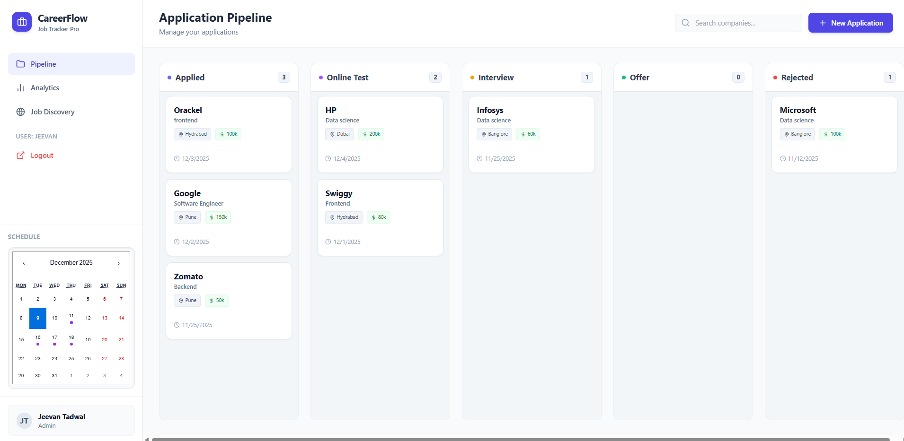
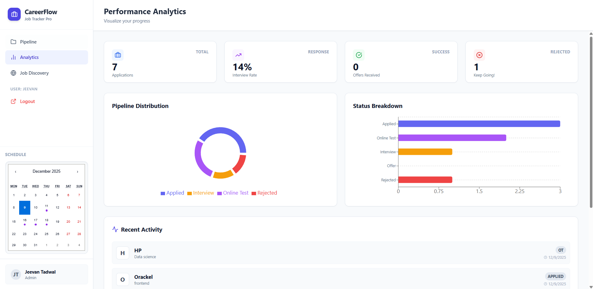
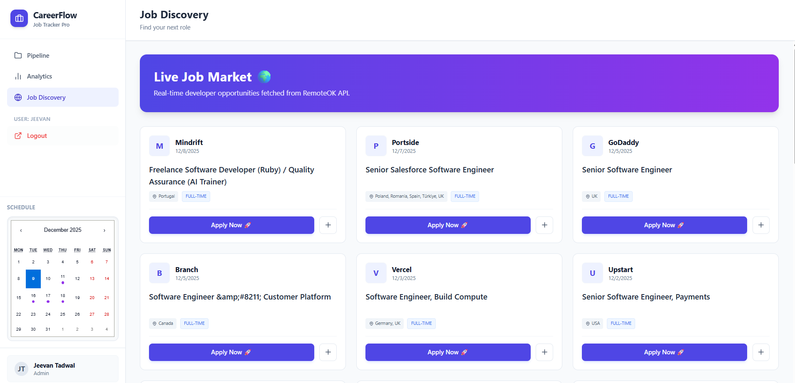

# 🚀 CareerFlow - Intelligent Job Application Tracker

**CareerFlow** is a comprehensive **Application Lifecycle Management (ALM)** platform engineered to streamline the job search process for developers. It replaces chaotic spreadsheets with a centralized, data-driven dashboard featuring a **Kanban pipeline**, **real-time analytics**, and an **integrated job discovery engine**.


---

## 📸 Application Overview

### **1. Intelligent Pipeline Management**
A drag-and-drop style Kanban board to track applications through every stage: *Applied* → *Online Test* → *Interview* → *Offer*.


### **2. Performance Analytics**
Visualizes your job search health with real-time charts. Tracks **Interview Rates**, **Success Ratios**, and **Activity Velocity** to help you optimize your strategy.


### **3. Live Job Market & Discovery**
An integrated feed that aggregates **real-time developer opportunities** from the RemoteOK API. Users can instantly import these jobs into their personal pipeline with one click.


---

## 🌟 Key Features

- **🔐 Secure Authentication:** Enterprise-grade login system using **JWT (JSON Web Tokens)** and **Bcrypt** hashing. Each user gets a private, isolated dashboard.
- **📊 Interactive Data Visualization:** Built with `Recharts` to transform raw application data into actionable insights (Donut Charts, Funnels).
- **📅 Smart Scheduling:** Integrated calendar system that automatically highlights upcoming interviews and Online Assessment (OA) deadlines.
- **🤖 Automated Data Entry:** "One-Click Add" feature populates job forms automatically when selecting roles from the Discovery feed.
- **📱 Responsive Glassmorphism UI:** A modern, aesthetic interface built with **Tailwind CSS** focusing on usability and focus.

---

## 🛠️ Tech Stack

| Domain | Technology Used |
| :--- | :--- |
| **Frontend** | React.js, Tailwind CSS, Lucide React, Recharts |
| **Backend** | Node.js, Express.js (REST API) |
| **Database** | MongoDB Atlas (Cloud-Native NoSQL) |
| **Security** | JWT (Session Management), Bcrypt (Encryption) |
| **Integrations** | Axios, RemoteOK API, Jobicy API |

---

## 📦 Installation & Local Setup

Follow these steps to run the complete suite locally.

### 1. Clone the Repository
```bash
git clone [https://github.com/Jeevannn11/CareerFlow.git](https://github.com/Jeevannn11/CareerFlow.git)
cd CareerFlow


2. Backend Setup (The Brain)
Navigate to the backend folder and install dependencies:

Bash

cd backend
npm install


3. Frontend Setup (The Interface)
Open a new terminal and navigate to the frontend:

Bash

cd ../frontend
npm install


🚀 Live Deployment
This project is deployed on enterprise-grade cloud infrastructure:

Backend API: Hosted on Render

Frontend UI: Hosted on Vercel

👤 Author
Jeevan Tadwal

Full Stack Developer & AI Engineer

GitHub | LinkedIn